# Smoking Buns

Please see below for full documentation for this project.  Any additional files will be linked where necessary.

## UX - Strategy

### 1) Project Goals

The goal of Smoking Buns is to provide a simple, coherently branded and easy to navigate way for customers to quickly find out 
more information about the restaurant of the same name.  With its strong Western theme and high quality products it is 
targeted at diners in their 20s-30s looking for a memorable dining experience.

### 2) Developer Goals

 - Build portfolio:  But keep in mind that whilst it is important to build a quality, feature-rich offering, superfluous elements should be avoided.
 - Build customer base:  Local business is a small community.  Do a great job here, referrals are inevitable.
 - Use available technologies: much as it is tempting, avoid re-inventing the wheel.
 - Stay focussed on the brief: the downfall of so many projects.

### 3) Restauranteur - User Story

The business owner, Smoke Brannigan, is a first time restauranteur with a clear vision for his business.  After an initial meeting he has outlined his requirements:

 - Grow online presence: The website must be highly compliant and SEO friendly, to provide as strong an online presence as possible.  
 This is particularly important given the number of real or fake dierectory sites out there which might potentially steal search rankings.
 - Drive home brand identity: The website must be consistent with the restaurant's branding to enhance the customer experience and help 
 build a memorable brand.  The owner is very proud of the theming inside and wants to showcase it online.
 - Provide menu information:  Allow users quick access to information about what is on the menu.
 - Increase bookings: The website needs to be effective at turning customer interest into bookings and revenue.
 - Grow social presence:  The website needs to provide access to the restaruant's social accounts so that the people can share and the business
 can grow.  It would also be useful to link review sites such as Google, Tripadvisor and Trustpilot.
 - Create positive engagement:  Representing a restaurant that prides itself in how the venue itself is part of the experience, the website needs to reflect this.
 It should be a place which users enjoy visiting and wish to return to, just like the restaurant itself!

 ### 4) Customer - User Story

The customer base will be people looking for a unique, high quality dining experience. It is anticipated that users of the website will have found it
 either through google or searching a review platform (particularly that on google maps), with the intention of dining out.  
 As such their requirements are clear:

  - Mobile Functionality:  the majority of users will be accessing the website on the go, either actively seeking a 
  restautant table in the immediate future or looking a day or two ahead. Indeed, many users in their 20s will 
  not own any device other than a mobile or tablet. They need the site to look just as good on their mobile devices whilst retaining full functionality.
  - Easy to Navigate: Millenials and Gen Z are all about immediacy, and they want to be able to find information quickly.  
  Links to various areas of the site should be obvious, responsive and consistent.
  - What do they sell? Because it is likely users will be looking at multiple restaurants, they want as much info as they can get online, 
  as fast as they can get it.  This includes the menu, which they want to be able to access and read quickly and in full.
  - Clear branding: As with any site, what it is about needs to be immediately apparent. This userbase needs to know what is on offer, as well as getting a feel for 
  the theme and style or the restaurant, from the very first page.
  - X-factor: The target audience wants, for want of a better word, cool stuff. They are interested in fancy lighting, interesting gadgets, 
  unusual effects. They would like a bit of pizzaz.
  - Contact Information: As important as the menu, they want to know where this place is, how to get there, and how to book it.  
  Our user base does not want to mess around.
  - Peer review: As a social generation, it is very important what their cohorts think. Our users need validation to help their purchasing 
  decisions, in the form of reviews and testimonials.
  - Venue Information:  Very much on a theme, they want to see what the place looks like to make sure it's sufficiently Instagramable.

  I think it should be clear from the above that many of the Business and Customer interests are aligned. 
  This will make identifying essential elements for the website relatively straightforward.

## UX - Scope

### Core Elements

Whilst brand and theming are obviously key to the success of the project, the overriding take-away from the user stories is the importance of immediacy.
This is not a complicated project, so it needs to deliver core areas first, and with that in mind:

 - Static HTML and CSS page.  Firstly as a constraint of this project but even so I would suggest it because of load times on mobile 
 and the nature of the project.  It doesn't require anything more.
 - Bootstrap: I am in two minds about bootstrap, as whilst it eases building out a site structure it can also cause complications with a bespoke site like this one.
 Ultimately I think it is worth using, mainly because it is built to be mobile compliant; the idiosyncracies of building a site for mobile cannot be overestimated!
 Any inconveniences or constraints would compromise elements beyond the core of the site, and therefore constitute an acceptable risk. 
 - Whilst it is tempting (and not impossible even given this constraint) to do something fancy on the homepage, the navigation menu should be clear, 
 obvious and consistently sited throughout the website, most likely as part of a header element.  As a web designer it hurts to say this, because I'd love to build 
 something unique and shiny (see additional elements).
 - Clear call to action in order to book, linking to a seperate booking/contact page. I believe it is worth including this call to 
 action on every page and possibly in the menu, but this is something to be explored elsewhere!
 - The full restaurant menu needs to be somewhere on the site, boldly but clearly laid out.  Again I think it's wise to keep this simple and in keeping with the brand.  
 There may be room to have some fun with it (for users as well) as the project develops.
 - there needs to be some section of a page or the site where there is peer review, be it links to review platforms or personal testimonials.
 This has come up as both key to the user base and as a factor for the owner in building brand awareness.
 - Restaurant overview:  On the homepage, ideally in a callout, people need to know what the restaruant is and what it sells. Provides immediacy.
 It's conventional, but it's conventional for a reason.
 - Restaurant information:  This can consist of a gallery, or series of images, showing the theming clearly and what the place is like in order to establish brand. 
 And showcase the restaurant theme.
 - Social platforms need to be linked to the website, I would suggest most likely in the footer, but also on the contact page.  
 Thought needs to be given to how prominent we make this element.
 - 404 page.

 ### Additional elements

 These aspects of the site are subject to time and technical constraints.  I think each one of these would 
 add value, and would like to incorporate them all if at all possible.

- with load times on mobile in mind I am of a mind to reduce dependencies as much as possible - so for example importing fonts, icons and 
libraries into the site structure rather than relying on a CDN.  For the site owner it also reduces risk of new versions of 
libraries etc deprecating and ultimately invalidating existing code.
When it comes to bootstrap in particular I will need to further my knowledge before attempting this!
- More elaborate menu links (as part of a homepage callout): I have several design ideas as to what this might look like and the type of 
transitions or css tricks that might make it happen.  Whilst it is not an essential element  I think it would add the interactivity 
and pizzaz that the target demographic craves, and help re-inforce the restaurant's brand identity.
- more interactive menu elements: whilst not essential to get the core message across, adding another layer of engagement to the menu and 
focring users to linger there might well lead to the dwell time to pick out a favourite and decide they're going to eat it.  Plus, you know, it'll look great.

### Future improvements

These elements are beyond the scope of this project, but I would definitely like to include them were this a live site

- active contact form:  This would be a simple matter.
- online booking system:  Absolutely essential element of any modern restaurant site, either imported from a widget or built ground-up.
- customer registration / rewards system:  can track customer visits, offer things like loyalty rewards, birthday specials, generic offers, etc.

## UX - Structure

### Header and Navigation (Core)

 - Given how key mobile compliance and responsiveness will be, the navigation will consist of a single 
layer menu, with every page on the site available through a single tap or click.
 - Menu elements will appear consistently at the top of the screen, along with the corporate logo.  There are multiple design 
 possiblities for this, and in all likelihood I will produce more than one version - either the logo appearing above the menu and 
 the menu at the top left, or as is conventional the logo at the top left and the menu at the top right, or vice versa.  The reason I am 
 leaning towards the first option is I want to build a mobile first website.  All user stories converge on the importance of navigation 
 being immediately avaliable.  Having an additional menubar to open would counteract this, and to be honest is a personal bug-bear of mine.
 With only 4 menu options there is no reason not to display them all on any size of screen.  
 Positioning the logo above them would enable them to be made more prominent and accessible.  This could of course be adjusted for larger screen 
 sizes but mobile considerations have to come first.
 - On hover/active menu buttons will show some form of transition to add interactivity and positive user feel.  This needs to be in keeping with the theme of the restaurant.

 ### Header and Navigation (Additional)

 - There is potential to include additional links to core site areas (menu, restaurant, contact) on the homepage with heightened interactivity.  
 This would take the form of either an old school shooting gallery with rotating images or bullet holes in a wooden wall, using CSS transitions. 
 Edited:  as this would be desktop only and this site is mobile led it is unlikely this will be happening
 Less elaborate options may need to be reverted to (not so much technically, but because these options may be reliant on audio to actually be any good.)
 - The mouse pointer could change to a cross-hair on mousing over these elements (or indeed the permanent navigation elements).  
 But we don't want to get too gimmicky here.
 Edited -  This would not work on mobile, which would lead to inconsistent experiences.

 ### Footer (core)

 - Social media icons
 - Call to action (book here)
 - Any legal schtick

 ### Homepage (core)

 - Reastaurant elevator pitch and description - the main callout has to first and foremost let everyone know what the site is about.
 - Main background image - in keeping with restaurant theming, without compromising readability or visual integrity.  This may require some trial and error.
 - Testimonials or selected online reviews:  peer review seen as crucial in adding value at the outset.

 ### Homepage (additional)

 - Fancy navigation elements outlining different key areas of the site (see navigation).  My big question mark is whether there is room for this. Even though it's a nice to have, it may just end up pushing far too much below the fold on a mobile device to the point where it is detrimental.
 I do not want to put anything on the desktop site that is not on the mobile site.

 ### Menu (core)

 - Information about what is on the menu, themed
 - The food menu must be easily digestible, but it can't take up too much space either.  People don't want to be scrolling down 
 forever to find out what's for pudding, or transitioning through multiple pages.

 ### Menu (additional)

 - Active / Mouse-over(on desktop) transitions.  the vision is to have some kind of image of a cowboy making suitably cowboyish comments on the indicated menu item.  
 This is technically easy enough, but the menu might not be the best place for it.

 ### Our Restaurant (core)

 - some images of different areas of the restaruant, showing the theming.  3 maximum with descriptions, or a gallery.  
 Given the lack of appropriate collateral, less is probably more

 ### Our Restaurant (additional)
 - this may actually be a better place for the talking cowboy head concept.
 Edited to add: representations of various members of the team is the design concept I decided on - how it is represented will be dependent on the image work.

 ### Contact (core)

 - A contact form for bookings is the most prominent part of this page, and the 'book here' button will link here.
 - add tripadvisor etc links to this page, along with the address.  

 ### Contact (additional)

 - could add a google map widget, or failing that I like the idea of a map drawn in the western style.  My imagework may or may not be up to that!
 - may be worth adding the social links again, but it ought not be necessary because I expect them to be very prominent in the footer.

 ## UX - Skeleton

 ### Design Choices

  - As this is imagined as a site predominently used on mobile and will be programmed with Bootstrap with that in mind, I began with the mobile layout and scaled from there.
  - I have attempted to keep the layout as consistent as possible with some amends for the landscape format of most desktop devices, keeping in mind people may well access the site on multoiple devices this familiarity is important.
  - In line with the gathered requirements, the menu is prominent on the screen and visibile at all times; nothing is hidden behind sub-menus or drop-downs.
  - I have kept the content of each page very simple and precisely on point with the menu descriptions.  The only doubt is the 'about' section which for me doesn't describe the content well enough.  Unfortunately longer alternatives may break the layout.
  - Main content layout on each page is consistent with no more than two vertical sections.
  - The homepage is kept the simplest of all;  as the landing point it is intended to provide instand value with clear description of what the site is about, re-inforced by visual style and independent reviews.
  - I have named the contact button 'book'. This means the main call to action tops every page and does not need to be placed elsewhere.  Likewise the first thing on that page is a form to book a table.  
  - As identifying the restaruant location could be considered important information, this should be included in the callout considering the 'contact' section is a call to action to book. 
  Likewise it may be worth including the address beneath the social and review links in the footer.
  - in order to retain clarity of content for each page, I decided it was best to include links to tripadvisor etc in the footer.  This is possible with the call to action in the header and groups well with the social links.
  - I chose 4 sections in the 'about restaurant' section to ensure balance on larger screens where they may be displayed side-by-side (Bootstrap XXL)
  - All the pages are designed so that the main information the page needs to get across is displayed above the fold.
  - As I developed the site, I discovered that different CSS methods would suit the various page layouts I proposed in my wireframes.  As such I used the following:
      - Bootstrap for the Header, Footer and Homepage.
      - Grid for the 'Menu' Page content (very structured content)
      - Flexbox for the 'About' and 'Book' pages. (discovered that using nested flexboxes and changing the axis made for great responsiveness.)
  - Booking form button - In a full deployment I would use a POST method to process the form using PhP, Javascript or such like, then write the contents to a relational database (potentially integrated with an online booking system). Keeping in mind the limited scope of this project, for the purposes of this deployment I have used a GET method to ensure the form will not work unless filled out correctly.  The page the values are passed to does nothing to process them, but it does link to a static page with a success message and route back to the homepage.  Keep in mind that this is not a secure solution, and therefore do not enter any sensitive data through the 'Book' page on this website.  Please note that this page does not feature in the wireframes because it was not conceived of until later in the project's development cycle.

  ### Wireframes

  NOTE: In the 1200px versions I have included a red dotted line as an indication of roughly where the fold would be on a 1200px screen.
  Although, for clarity, I have provided visual representation of the various mobile devices, I would not expect all content to be above the fold as depicted; it will also not be as important on mobile as long as the site retains clarity regarding the content on each page.

  #### Default Screen Size (576px)

  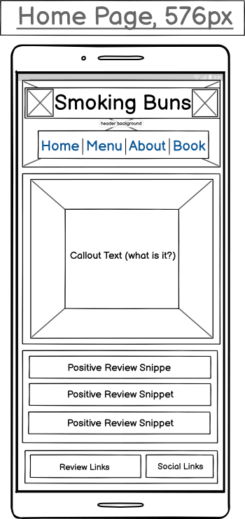&nbsp; &nbsp; &nbsp; &nbsp; &nbsp; &nbsp; 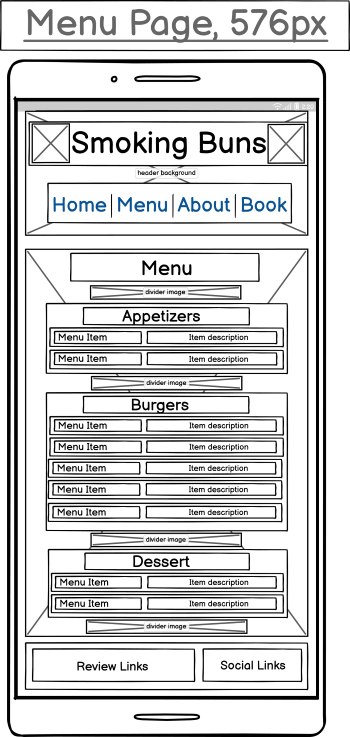
     
  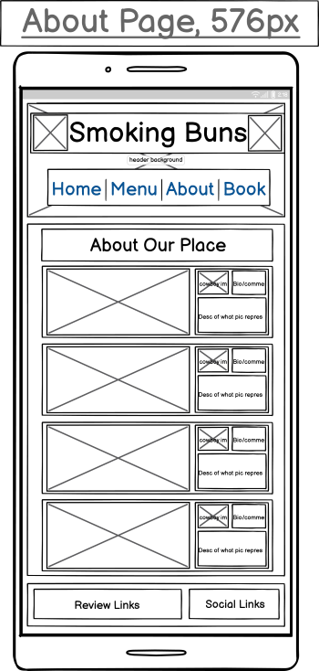&nbsp; &nbsp; &nbsp; &nbsp; &nbsp; &nbsp; 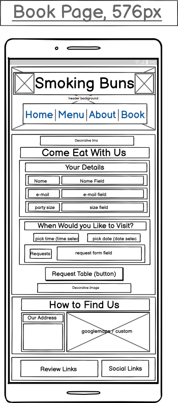   

  #### Tablet Screen Size (768px)

  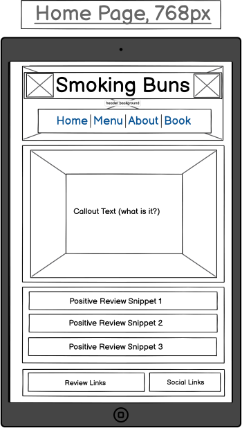&nbsp; &nbsp; &nbsp; &nbsp; &nbsp; &nbsp; 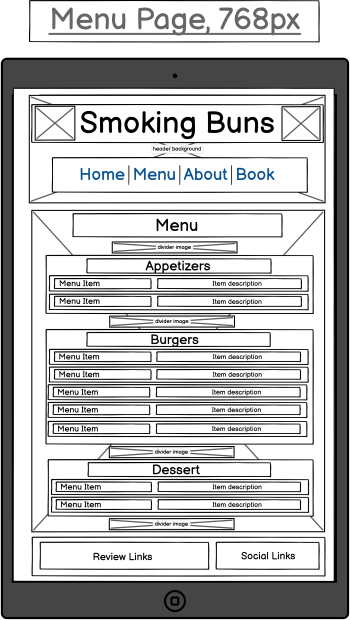
     
  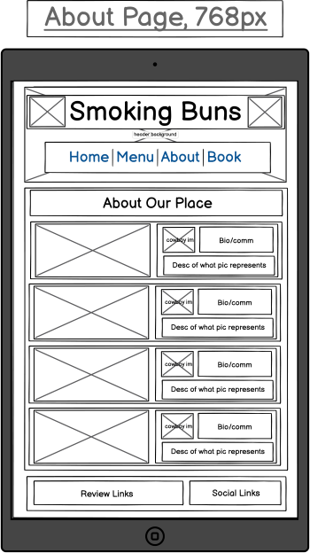&nbsp; &nbsp; &nbsp; &nbsp; &nbsp; &nbsp; 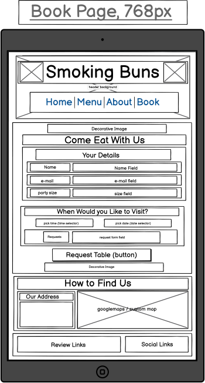

  #### Small Desktop/Laptop Screen Size (1200px)

  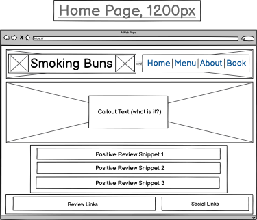&nbsp; &nbsp; &nbsp; &nbsp; &nbsp; &nbsp; 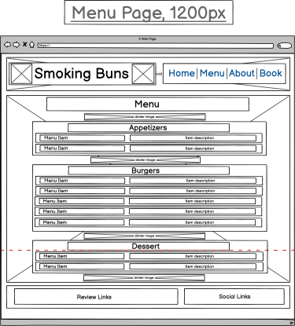
     
  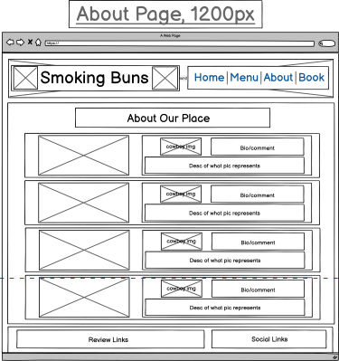&nbsp; &nbsp; &nbsp; &nbsp; &nbsp; &nbsp; 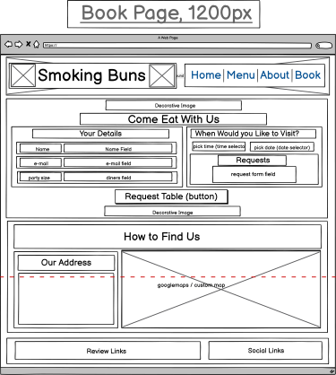

   ## UX - Surface

   ### Color - backgrounds

   The color scheme is intended to be evocative of the Wild West. For me the idea of a wood background began with the header but made sense as a background for the page from both a design and technical standpoint. I made sure it was a dark brown and actually darkened the wallpaper image I initially downloaded using GIMP to ensure legiblity of text and to ensure the look and feel was as I intended.  The general style of all pages is intended to invoke either text embossed in a wooden frame or messages pinned to a noticeboard- hence the cream colored old-style parchment which works excellently with the dark brown.  The transparency is intended to help readability of other sections of the site.  The footer uses a white transparency to differentiate itself from the main sections.

   ### Text and Fonts

   To keep things simple and readable I opted for white text against the dark brown background.  This is inverted to black text upon the various noticeboard sections.

   The main font was chosen for its legibility above some of the alternatives.  It is intended to represent a classic Western Style script and to be instantly recognisable as such.  The title font is a more eloborate extension of the theme - because the size of the title area using a more intricate font does not affect its legibility and I think adds greatly to the look and feel.  All fonts are stored locally with future-proofing in mind.  Additionally I feel like using fonts outside of google significantly increased my options.

   ### Images

   The various images used are influenced by there being little collaterol for the (fictional) venue.  The logos either side of the title and the smoking gun spacer were built in Inkscape, using various sources as inspiration.  I chose to use vector images where possible because of how easily and cleanly they scale to different screen sizes without loss of resolution. 
   
   I felt the main stock image had to represent the product, and whilst the look and feel of the site gets the theme across thoughout, in the end it would be nothing without a tasty burger.  I re-used this image for the about section.   I wanted to get across all aspects of the restaurant and give it some real personality in this section, hence the theme of introducing various members of staff and presenting the information as a quote from them.  Of the other images on this page, the various portraits, images and text are mostly placeholders but I think also get across very well how it is intended to be a fun venue.  I kept the menu page as simple as possible, as this page is simply about providing information as clearly as possible.  

   Initially the footer logos were based on the color schemes of the various brands;  I scaled this back to black and white in keeping with the mouse-over effects and the general look and feel of the site.

   ### Navigation/Effects

   I immediately settled on a sheriff star to act as a visual indicator of a state change on the menu - the gold star indicates a hover/active state and the silver star indicates the current page.  I believe this gives tremendous clarity of what is going on for the user, and adds to the overall theme as well as adding value to the page.

   Within the footer I opted for a white background in an active/hover state, to provie a contrast to both the black icons and the background wood effect/transparency.

   I have not added any css transitions or effects, for the main reason that I don't believe they would add a lot of value to the target audience, ie users on mobile devices with smaller screens.   I also think the look and feel of the site has a strong enough identity already.

   ### Responsiveness

   In addition to basic bootstrap classes, I relied heavily upon media queries to hone page design and layout as the website scaled to different screen sizes. Given that the venerable Samsung Galaxy S8 has a CSS screen width of 360 pixels, In order to be safe I designed the site with page sizes from 320px to 1800px in mind.

   Generally speaking as the pages scaled up, I increased margins and padding, and increased font and image sizes to maintain optimal look and feel.  On desktop I used Bootstrap to change the position of content on the page in the header.  I also used Flexbox to adjust the layout for desktop on the 'About' and 'Book' pages.

## Testing and Issues

### Testing

Testing Documentation [HERE](TESTING.md)

### Issues

I've documented here the major problems I encourtered during the course of the initial build (prior to testing) and the measures I took to overcome them.

GENERAL:

 - Horizontal scrolling issue
    - There is a small horizontal scroll across all pages. I traced the issue to the footer using web developer tools. One by one I eliminated all the child elements as the cause and found the source of the problem to be a bootstrap row element taking up more than the viewport's width across all screen sizes.  This was fixed by setting the width of the row to 100%.                     

HEADER / FOOTER / HOMEPAGE:

 - Background Hover Image not centered in element
    - There were a number of issues centering the background hover image (sheriff star) over the text of the menu options.  This was eventually solved by setting the width of the image to 100% and the height to auto, to keep the aspect ratio.  I foudn that I was then able to adjust the size of the image by setting a fixed height for the parent element.  Final adjustments were made by adjusting the size of the menu text.  All these values are then adjusted according to screen width.
 - Callout image positioning
    - I found that on larger screen sizes the hero image in the callout section focussed on the chips rather than the burger as intented.  This was overcome in 2 ways - firstly by changing the absolute positioning of 0 to the bottom of the element to a percentage, to ensure the image was focussed on the correct area even as the screen size grew.  I also reduced the size of the image so that you could see more of it on larger screen sizes.
- Footer background positioning
    - I found that the background change on hover wasn't encompassing the whole height of the element.  I fixed this by changing the display property of the container to flex.  I was also then able to justify and align the various icons.

ABOUT PAGE:

- Images overflowing their containing elements.
    - I had a number of issues caused by the main image of each section overflowing its container, which revealed itself as I scaled up the site.  I noticed that it only applied to the lower resolutuion of the images, and so was able to resolve it by setting by fixed sizes for the container.

BOOK PAGE:

- Flex Container not working as expected
    - On expanding to the landscape break point (where the main axis should have reverted to column) the booking elements remained in rows.  The mistake I made was positioning the form element as the first child of the flexbox container.  By moving the form element outside of the container and ensuring the flex elements were the only children I resolved this.

## Deployment

### Initial Deployment

The website has been deployed [HERE](https://github.com/rowlandcoping/smokingbuns/) via github pages.

### Deployment Instructions

If you wish to deploy this website yourself, here is how to go about it.

1:  Using github pages

- Log in to or create your own github account [HERE](https://github.com/).
- Go to the Smoking Buns repository [HERE](https://github.com/rowlandcoping/smokingbuns) and select 'Fork' to create your own snapshot of the repository.
- From the forked repository select 'Settings'
- From the settings page select 'Pages' from the 'Code and automation' section of the left menu.
- Select 'deploy from a branch' from the 'source menu' and then select the 'main' branch of the forked repo, along with 'root' as the folder.
- Press save.  The site will now be deplyed from your own forked repository!

2:  Using source files

Because this website is built using nothing but html and css you can deploy it in any web browser from local files.  Please note at the time of writing you will require internet access as the site uses a CDN to access bootstrap 5 files.

- Go to the Smoking Buns repository [HERE](https://github.com/rowlandcoping/smokingbuns) 
- Download all the files in the repository except for the '.devcontainer' folder and the '.gitignore' file to a folder on your local machine.
- In your local folder, right click the 'index.html', select 'Open With' and then select any web browser.

NB If you wish you could also deploy these files by copying and pasting them to the 'www' folder of your own web host, but keep in mind that the method of deployment will vary depending on the web hosting package you use.

NBB If you are using a Linux operating system running Apache you can simply save the files in your local '/var/www/html' folder and deploy by typing 'localhost' into a browser window. Please see instructions for installing Apache [HERE](https://ubuntu.com/tutorials/install-and-configure-apache#1-overview) if you haven't already.  
