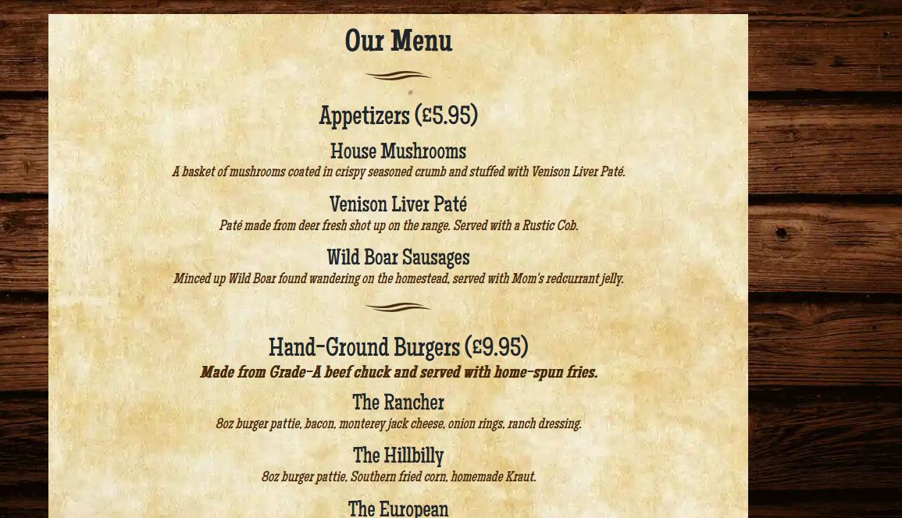
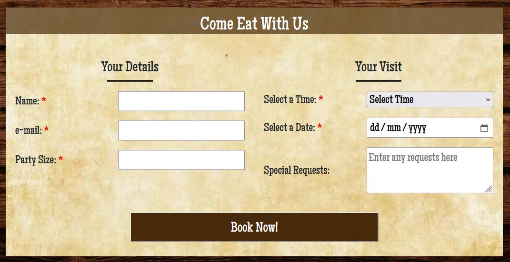
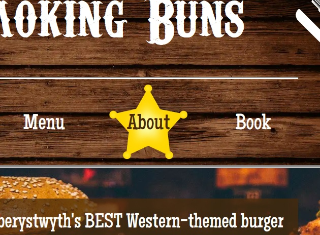
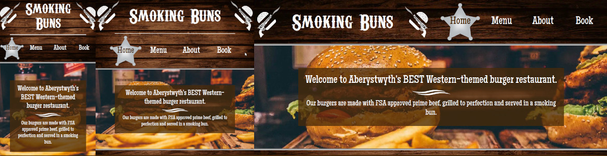
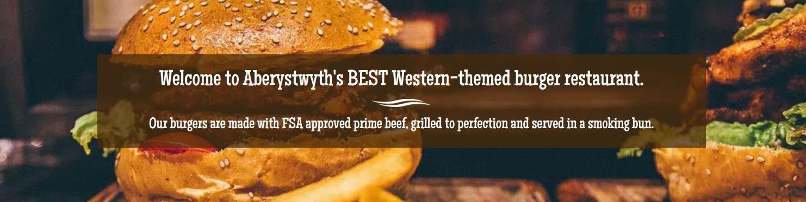
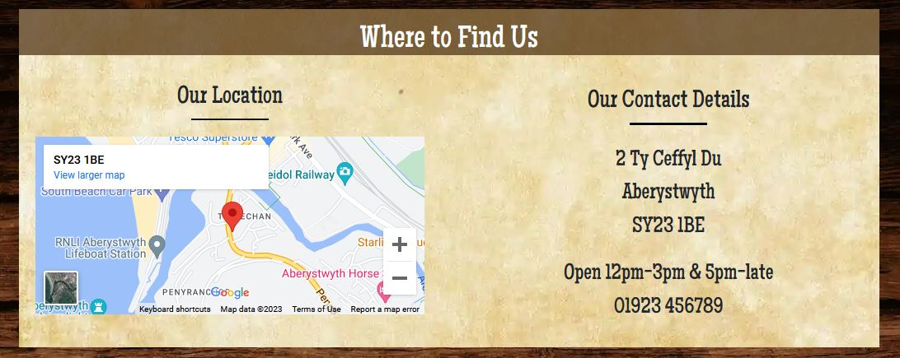
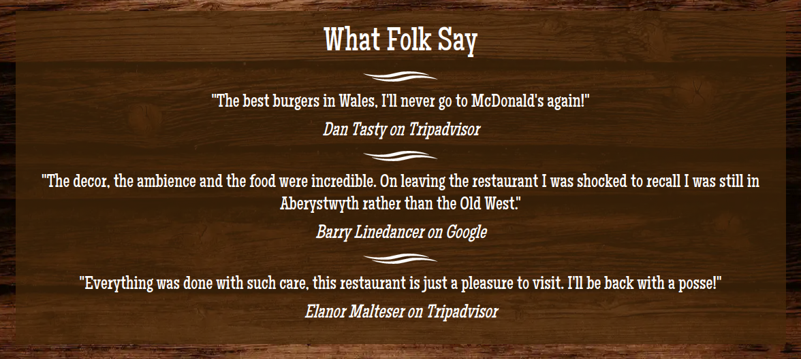
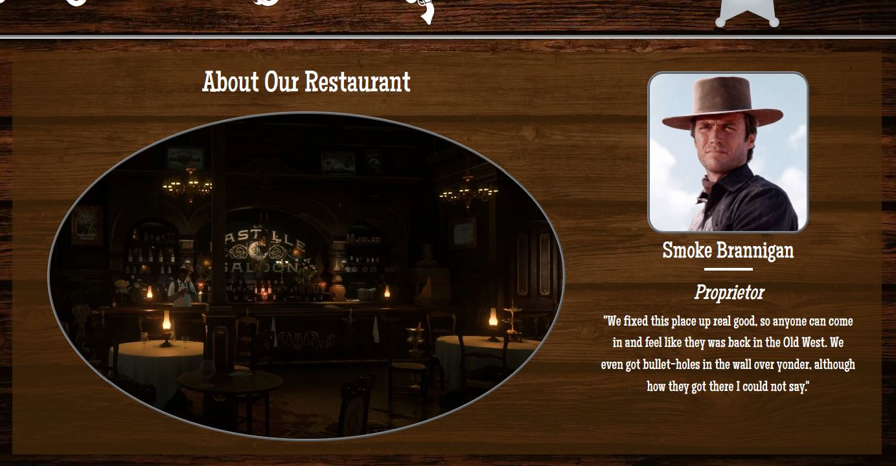

# Testing Documentation

([return to README](README.md))

## Contents

### Audit and Validation

[HTML Validation](#html-validation)\
[CSS Validation](#css-validation)\
[Lighthouse Audit](#lighthouse-audit)

### User Story Validation

[Restauranteur User Stories](#restauranteur-user-stories)\
[Customer User Stories](#customer-user-stories)

### Technical Testing

[Error Testing](#error-testing)\
[Manual Testing](#manual-testing)

## Code Validation

### HTML Validation

([back to top](#testing-documentation))

I have completed a final validation of all HTML pages using the [W3C HTML validator](https://validator.w3.org/).\
I found two errors on the 'book.html' page:

- The empty option element did not have a label for screen-readers.
- There was a stray end tag for an anchor element on the page.

Both errors were easily rectified; all other pages showed no errors.

### CSS Validation

([back to top](#testing-documentation))

I have completed a final validation of my 'style.css' file using the [W3C CSS validator](https://jigsaw.w3.org/css-validator/).\
No errors were found.

### Lighthouse Audit

([back to top](#testing-documentation))

The Lighthouse audits I initially ran had one common theme, that I needed to add meta-descriptions and reduce image sizes across the board. The background and footer images in particular were over-sized and needed serious slimming down. On the 'about' and 'menu' page I did not have heading elements in correct sequential order.

IMAGES:

I scaled images to more appropriate sizes and compressed anything that wasn't a vector in a .webp format.

META DESCRIPTIONS:

I added meta descriptions to all pages.

HEADERS:

I ensured that heading tags were ordered sequentially, without skipping. This involved a great deal of work adjusting their associated media queries, esepecially on the 'about' page.

RESULTS:

Here are the Lighthouse results following my remedial work:

## User Story Validation

### Restauranteur User Stories

([back to top](#testing-documentation))

_"Grow online presence: The website must be highly compliant and SEO friendly..."_\
Site uses semantic elements throughout, contains appropriate meta elements, clean code and looks great on any device.

_"Drive home brand identity: The website must be consistent with the restaurant's branding..."_\
The site had a very strong and consistent Western theme throughout and showcases the venue and staff.

_"...Allow users quick access to information about what is on the menu"_\
The website's navigation is obvious and not hidden or cluttered, and the menu.html page contains clear and comprehensive menu information.

_"The website needs to be effective at turning customer interest into bookings and revenue"_\
The option to book is part of the menu structure, and thus this call to action appears througout. The booking page contains all the information needed to plan a visit, prominently displayed.

_"Grow social presence: The website needs to provide access to the restaruant's social accounts so that the people can share and the business can grow. It would also be useful to link review sites such as Google, Tripadvisor and Trustpilot."_\
The footer on every page not only contains social links but also contains links to Tripadvisor and Google for peer review.

_"Create positive engagement... It should be a place which users enjoy visiting and wish to return to, just like the restaurant itself!"_\
The eye-catching logos and fun 'sheriff star' menu backgrounds along with the attractive fonts, eyecatching images and intuitive layout ought to result in people coming to visit the site even when they're not hungry!

### Customer User Stories

([back to top](#testing-documentation))

_"Mobile Functionality: ... They need the site to look just as good on their mobile devices whilst retaining full functionality."_\
The site was build mobile upwards, starting in all cases with a 360px screen width and then adjusting upwards to desktop screen sizes. This is reflected in some of the design choices - for example to keep the site clean there are no transitions or features that would not be functional on mobile.

_"Easy to Navigate... Links to various areas of the site should be obvious, responsive and consistent."_\
The navigation is clear and obvious on all device sizes, with additional immediacy through having no additional widgets to open. The navigation is the core of the site.

_"What do they sell? users... want as much info as they can get online, as fast as they can get it. This includes the menu, which they want to be able to access and read quickly and in full."_\
The main index.html callout immediately details what the restaurant sells, its theme and where it is located. Navigation is immediate and clear, with the menu.html the first option.

_"Clear branding: This userbase needs to know what is on offer, as well as getting a feel for the theme and style or the restaurant, from the very first page."_\
The index.html styling and callout text provides an immediate overview of the restaruant and what it sells, whilst clearly communicating the theme through styling and fonts. The big picture of a tasty burger gets home what they can expect to eat when they visit!

_"X-factor: The target audience wants, for want of a better word, cool stuff."_\
My options have been more limited in scope than I would like because of the limitations of mobile.  However, the unique menu visuals, entertaining fonts and eye-catching theming set this website apart from others.

_"Contact Information: As important as the menu, they want to know where this place is, how to get there, and how to book it."_\
This was a trade-off, and in the end a matter of balancing the need to drive bookings against providing more general information. However the index.html callout makes clear where the restaurant is located, which means I have been able to focus efforts on the call to action, which is to book a table.  This call to action is displayed prominently as part of the main navigation. The booking page contains full contact information and a map of the area, in addition to the booking form.

_"Peer review: As a social generation, it is very important what their cohorts think. Our users need validation to help their purchasing decisions, in the form of reviews and testimonials."_\
The index.html page provides immediate validation in the form of positive customer reviews, and the footer means that links to social and review platforms are prominent throughout.

_"Venue Information: Very much on a theme, they want to see what the place looks like to make sure it's sufficiently Instagramable."_\
The about section contains appropriate images of the venue and details about food, staff and decor, providing all the information people need.

## Technical Testing

### Error Testing

([back to top](#testing-documentation))

I've documented here the major problems I encountered during the course of building and testing the site, and the measures I have taken to overcome them.

The website has been tested throughout on Firefox and Chrome, in both Linux and Windows using the responsive mode in developer tools to trigger all the break points up to my full-screen desktop resolution of 1920px. It has also been tested on a Samsung Galaxy S8 in Chrome with a CSS screen width of 360px. Although I have extended this (across multiple screens) to 3000px plus and included a 2500px break point, I have not been able to test on an HD display as nobody I know has one.

GENERAL:

- Horizontal scrolling issue:
  - There was a small horizontal scroll across all pages. I traced the issue to the footer using web developer tools. One by one I eliminated all the child elements as the cause and found the source of the problem to be a bootstrap row element taking up more than the viewport's width across all screen sizes. This was fixed by setting the width of the Bootstap row element to 100%.

HEADER / FOOTER / index.html:

- Background Hover Image not centered in element

  - There were a number of issues centering the background hover image (sheriff star) over the text of the menu options. This was eventually solved by setting the width of the image to 100% and the height to auto, to keep the aspect ratio. I foudn that I was then able to adjust the size of the image by setting a fixed height for the parent element. Final adjustments were made by adjusting the size of the menu text. All these values are then adjusted according to screen width.

- Callout image positioning:

  - I found that on larger screen sizes the hero image in the callout section focussed on the chips rather than the burger as intented. This was overcome in 2 ways - firstly by changing the absolute positioning of 0 to the bottom of the element to a percentage, to ensure the image was focussed on the correct area even as the screen size grew. I also reduced the size of the image so that you could see more of it on larger screen sizes.

- Footer sizing and positioning (part 1):

  - I found that the background change on hover wasn't encompassing the whole height of the element. I fixed this by changing the display property of the container to flex. I was also then able to justify and align the various icons.

- Footer sizing and positioning (part 2):
- After discussions with my mentor I re-built the footer to stop the images scaling with the screen width to become outsized on larger desktop monitors. I achived this by setting fixed values for the image height and wrapping the container to the image. This was unfortunately not compatible with the previous fix. The solution I came upon was expanding the padding for the hover pseudo element until the background took up the desired amount of space. This is not a solution I'm particularly happy with but I think it may be the best one as long as the footer is built in Bootstrap.

- Footer sizing and positioning (part 3):
- I made a final attempt to have consistancy with the hover image in the footer. I discovered the image wasn't centred in the anchor element which was causing the problem, and solved it by setting the anchor display property to flex and centering the content. This also meant I could consistently control the padding by setting a height and width for the anchor element, and it didn't break the layout. I am still unable to center the anchor within the list element horizontally, but on substantial review I am not sure that it is possible (ie when nesting images within an anchor tag within a list element) without breaking the layout of the site. Once I realised this it was either rebuild it or keep what I have, and given the minimal visual impact I prefer the semantic clarity of placing the footer navigation in an unordered list.

- During testing I have noticed that the text in the menu is not vertically centred in the anchor element, which meant that the sheriff stars looked unbalanced. Because of the bootstrap layout, I was unable to vertically center the text my any conventional means, but I discovered that if I wrapped the text in an h2 tag and set a small negative margin I could center it this way. From the research I have done I can see nothing semantically wrong with this and it looks much better.
- On preparing to take screengrabs in Windows I discovered that the above fix rendered differently in Windows to other devices (Linux / Android) on which I had tested it. It is interesting that the way CSS displays should be dependent on OS, it seems a Linux base gives different outcomes! This makes it hard to fix. On testing in Firefox and Chrome on Windows using dev tools setting the bottom margin at 0 perfectly centers the text in the star, but until the change is pushed it's impossible to know if this will work on mobile and Linux, and of course vice versa if I did it the other way around! See screengrabs below for the issue:

Android on chrome:
\
Windows 10 on chrome:

I decided that the zero margin fix was the best option for a number of reasons:

- On Linux and mobile it is not perfect but acceptable.
- Setting the margin at zero is a more consistent solution and doesn't require amends via media queries.
- The assessors of this project will most likely be viewing this on Windows devices where it renders perfectly.

Here are the screengrabs post-fix:

Android on chrome:
\
Windows 10 on chrome:

I am not sure this bug is fixable with the current layout. I don't really understand why the site renders differently on the same browser depending on the operating system - it is certainly not clear from investigating using developer tools. It is an important consideration when designing for mobile however.  If it is down to Bootstrap I would be surprised, given I chose this framework for the header and footer precisely for the support it provides for responsive elements.  I would imagine that Bootstrap elements would work better in more generic layouts and this is something I need to consider going forward. Perhaps it is more a quirk of using list elements for these navigation sections - whilst it seems to be a widely adopted standard, 'li' elements appear to pose unique difficulties in CSS that are not well documented.

about.html:

- Images overflowing their containing elements:
  - I had a number of issues caused by the main image of each section overflowing its container, which revealed itself as I scaled up the site. I noticed that it only applied to the lower resolutuion of the images, and so was able to resolve it by setting by fixed sizes for the container.

book.html:

- Flex Container not working as expected:
  - On expanding to the landscape break point (where the main axis should have reverted to column) the booking elements remained in rows. The mistake I made was positioning the form element as the first child of the flexbox container. By moving the form element outside of the container and ensuring the flex elements were the only children I resolved this.

SUBMISSION PAGE:

- Footer was stranded halfway up the page, relative/absolute positioning did not solve the problem.
  - Setting the body display properties to flex and the footer's top margin to auto solved this.

### Manual Testing

([back to top](#testing-documentation))

I have tested all the links and also the responsiveness across various break points on the deployed site, to ensure nothing in the layout is broken, outlined in the table below. These tests were carried out in Chrome on Linux:

| Feature Tested                        | Expected Outcome                 | Result  |
| ------------------------------------- | -------------------------------- | ------- |
| index.html Title link                 | Links to index.html              | Success |
| index.html Home link                  | Links to index.html              | Success |
| index.html Menu link                  | Links to menu.html               | Success |
| index.html About link                 | Links to about.html              | Success |
| index.html Book link                  | Links to book.html               | Success |
| index.html Snapchat link              | Links to Instagram               | Success |
| index.html Instagram link             | Links to Snapchat                | Success |
| index.html Facebook link              | Links to Facebook                | Success |
| index.html Tripadvisor link           | Links to Tripadvisor             | Success |
| index.html Google link                | Links to Google Maps             | Success |
| index.html responsiveness 320px       | Displays without error at 320px  | Success |
| index.html responsiveness 360px       | Displays without error at 360px  | Success |
| index.html responsiveness 450px       | Displays without error at 450px  | Success |
| index.html responsiveness 576px       | Displays without error at 576px  | Success |
| index.html responsiveness 600px       | Displays without error at 600px  | Success |
| index.html responsiveness 600px       | Displays without error at 768px  | Success |
| index.html responsiveness 900px       | Displays without error at 900px  | Success |
| index.html responsiveness 1200px      | Displays without error at 1200px | Success |
| index.html responsiveness 1400px      | Displays without error at 1400px | Success |
| index.html responsiveness 1800px      | Displays without error at 1800px | Success |
| menu.html Title link                  | Links to index.html              | Success |
| menu.html Home link                   | Links to index.html              | Success |
| menu.html Menu link                   | Links to menu.html               | Success |
| menu.html About link                  | Links to about.html              | Success |
| menu.html Book link                   | Links to book.html               | Success |
| menu.html Snapchat link               | Links to Instagram               | Success |
| menu.html Instagram link              | Links to Snapchat                | Success |
| menu.html Facebook link               | Links to Facebook                | Success |
| menu.html Tripadvisor link            | Links to Tripadvisor             | Success |
| menu.html Google link                 | Links to Google Maps             | Success |
| menu.html responsiveness 320px        | Displays without error at 320px  | Success |
| menu.html responsiveness 360px        | Displays without error at 360px  | Success |
| menu.html responsiveness 450px        | Displays without error at 450px  | Success |
| menu.html responsiveness 576px        | Displays without error at 576px  | Success |
| menu.html responsiveness 600px        | Displays without error at 600px  | Success |
| menu.html responsiveness 600px        | Displays without error at 768px  | Success |
| menu.html responsiveness 900px        | Displays without error at 900px  | Success |
| menu.html responsiveness 1200px       | Displays without error at 1200px | Success |
| menu.html responsiveness 1400px       | Displays without error at 1400px | Success |
| menu.html responsiveness 1800px       | Displays without error at 1800px | Success |
| about.html Title link                 | Links to index.html              | Success |
| about.html Home link                  | Links to index.html              | Success |
| about.html Menu link                  | Links to menu.html               | Success |
| about.html About link                 | Links to about.html              | Success |
| about.html Book link                  | Links to book.html               | Success |
| about.html Snapchat link              | Links to Instagram               | Success |
| about.html Instagram link             | Links to Snapchat                | Success |
| about.html Facebook link              | Links to Facebook                | Success |
| about.html Tripadvisor link           | Links to Tripadvisor             | Success |
| about.html Google link                | Links to Google Maps             | Success |
| about.html responsiveness 320px       | Displays without error at 320px  | Success |
| about.html responsiveness 360px       | Displays without error at 360px  | Success |
| about.html responsiveness 450px       | Displays without error at 450px  | Success |
| about.html responsiveness 576px       | Displays without error at 576px  | Success |
| about.html responsiveness 600px       | Displays without error at 600px  | Success |
| about.html responsiveness 600px       | Displays without error at 768px  | Success |
| about.html responsiveness 900px       | Displays without error at 900px  | Success |
| about.html responsiveness 1200px      | Displays without error at 1200px | Success |
| about.html responsiveness 1400px      | Displays without error at 1400px | Success |
| about.html responsiveness 1800px      | Displays without error at 1800px | Success |
| book.html Title link                  | Links to index.html              | Success |
| book.html Home link                   | Links to index.html              | Success |
| book.html Menu link                   | Links to menu.html               | Success |
| book.html About link                  | Links to about.html              | Success |
| book.html Book link                   | Links to book.html               | Success |
| book.html Snapchat link               | Links to Instagram               | Success |
| book.html about.html Instagram link   | Links to Snapchat                | Success |
| book.html Facebook link               | Links to Facebook                | Success |
| book.html Tripadvisor link            | Links to Tripadvisor             | Success |
| book.html Google link                 | Links to Google Maps             | Success |
| book.html Name field                  | error if not filled out          | Success |
| book.html e-mail field                | error if not filled out          | Success |
| book.html e-mail field                | error if not correct format      | Success |
| book.html party size field            | error if not filled out          | Success |
| book.html time select field           | error if not filled out          | Success |
| book.html date picker                 | error if not filled out          | Success |
| book.html Submit button               | submits data to submit.html      | Success |
| book.html responsiveness 320px        | Displays without error at 320px  | Success |
| book.html responsiveness 360px        | Displays without error at 360px  | Success |
| book.html responsiveness 450px        | Displays without error at 450px  | Success |
| book.html responsiveness 576px        | Displays without error at 576px  | Success |
| book.html responsiveness 600px        | Displays without error at 600px  | Success |
| book.html responsiveness 600px        | Displays without error at 768px  | Success |
| book.html responsiveness 900px        | Displays without error at 900px  | Success |
| book.html responsiveness 1200px       | Displays without error at 1200px | Success |
| book.html responsiveness 1400px       | Displays without error at 1400px | Success |
| book.html responsiveness 1800px       | Displays without error at 1800px | Success |
| submit.html Title link                | Links to index.html              | Success |
| submit.html Home link                 | Links to index.html              | Success |
| submit.html Menu link                 | Links to menu.html               | Success |
| submit.html About link                | Links to about.html              | Success |
| submit.html Book link                 | Links to book.html               | Success |
| submit.html Snapchat link             | Links to Instagram               | Success |
| submit.html about.html Instagram link | Links to Snapchat                | Success |
| submit.html Facebook link             | Links to Facebook                | Success |
| submit.html Tripadvisor link          | Links to Tripadvisor             | Success |
| submit.html Google link               | Links to Google Maps             | Success |
| submit.html responsiveness 320px      | Displays without error at 320px  | Success |
| submit.html responsiveness 360px      | Displays without error at 360px  | Success |
| submit.html responsiveness 450px      | Displays without error at 450px  | Success |
| submit.html responsiveness 576px      | Displays without error at 576px  | Success |
| submit.html responsiveness 600px      | Displays without error at 600px  | Success |
| submit.html responsiveness 600px      | Displays without error at 768px  | Success |
| submit.html responsiveness 900px      | Displays without error at 900px  | Success |
| submit.html responsiveness 1200px     | Displays without error at 1200px | Success |
| submit.html responsiveness 1400px     | Displays without error at 1400px | Success |
| submit.html responsiveness 1800px     | Displays without error at 1800px | Success |
| 404.html Title link                   | Links to index.html              | Success |
| 404.html Home link                    | Links to index.html              | Success |
| 404.html Menu link                    | Links to menu.html               | Success |
| 404.html About link                   | Links to about.html              | Success |
| 404.html Book link                    | Links to book.html               | Success |
| 404.html Snapchat link                | Links to Instagram               | Success |
| 404.html about.html Instagram link    | Links to Snapchat                | Success |
| 404.html Facebook link                | Links to Facebook                | Success |
| 404.html Tripadvisor link             | Links to Tripadvisor             | Success |
| 404.html Google link                  | Links to Google Maps             | Success |
| 404.html responsiveness 320px         | Displays without error at 320px  | Success |
| 404.html responsiveness 360px         | Displays without error at 360px  | Success |
| 404.html responsiveness 450px         | Displays without error at 450px  | Success |
| 404.html responsiveness 576px         | Displays without error at 576px  | Success |
| 404.html responsiveness 600px         | Displays without error at 600px  | Success |
| 404.html responsiveness 600px         | Displays without error at 768px  | Success |
| 404.html responsiveness 900px         | Displays without error at 900px  | Success |
| 404.html responsiveness 1200px        | Displays without error at 1200px | Success |
| 404.html responsiveness 1400px        | Displays without error at 1400px | Success |
| 404.html responsiveness 1800px        | Displays without error at 1800px | Success |

([return to README](README.md))
