Return to [README](README.md).

For the 1200px versions I have included a red dotted line as an indication of roughly where the fold would be on a 1200px screen.
Although, for clarity, I have provided visual representation of the various mobile devices, I would not expect all content to be above the fold as depicted; it will also not be as important on mobile as long as the site retains clarity regarding the content on each page.

#### Default Screen Size (576px)

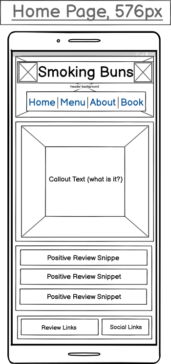&nbsp; &nbsp; &nbsp; &nbsp; &nbsp; &nbsp; 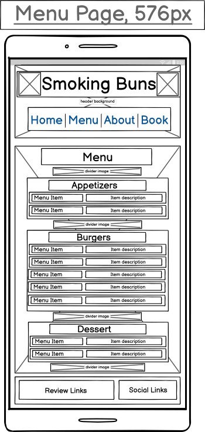
   
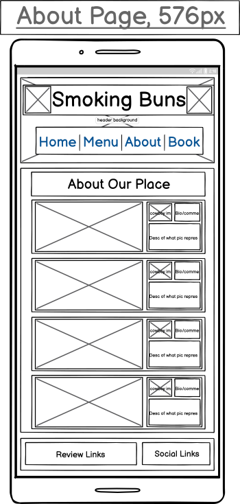&nbsp; &nbsp; &nbsp; &nbsp; &nbsp; &nbsp; 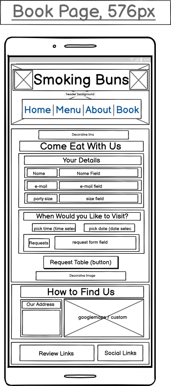   

#### Tablet Screen Size (768px)

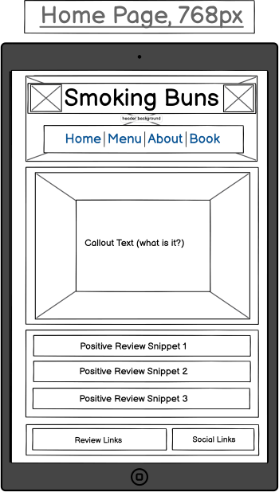&nbsp; &nbsp; &nbsp; &nbsp; &nbsp; &nbsp; 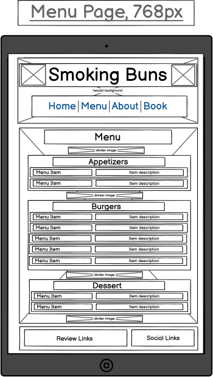
   
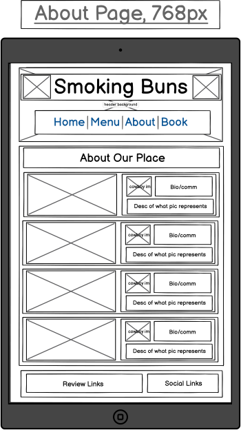&nbsp; &nbsp; &nbsp; &nbsp; &nbsp; &nbsp; 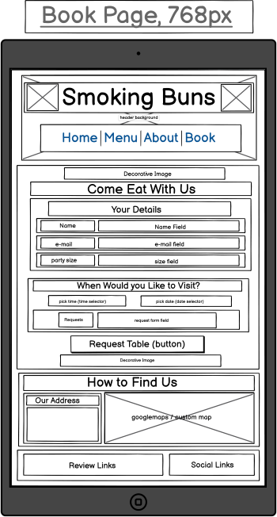

#### Small Desktop/Laptop Screen Size (1200px)

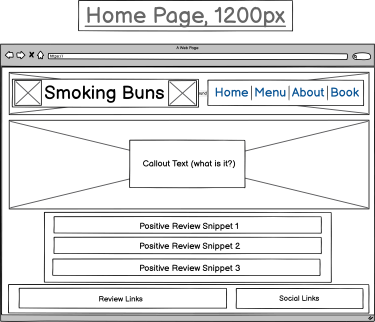&nbsp; &nbsp; &nbsp; &nbsp; &nbsp; &nbsp; 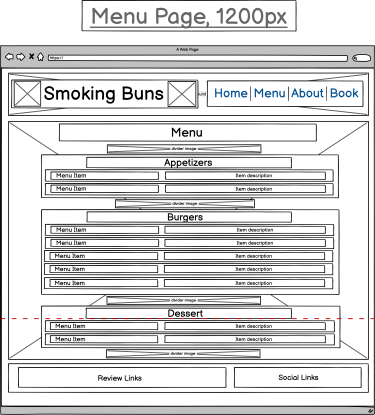
   
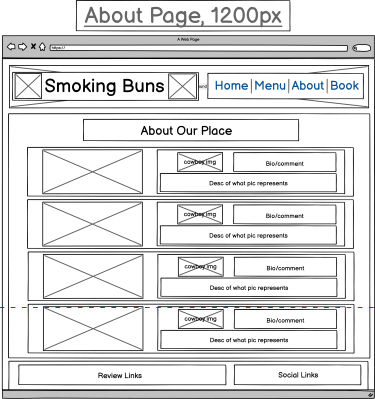&nbsp; &nbsp; &nbsp; &nbsp; &nbsp; &nbsp; 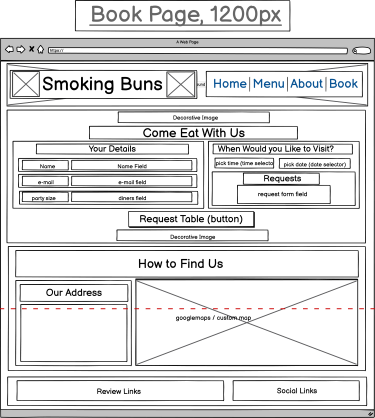

Return to [README](README.md).